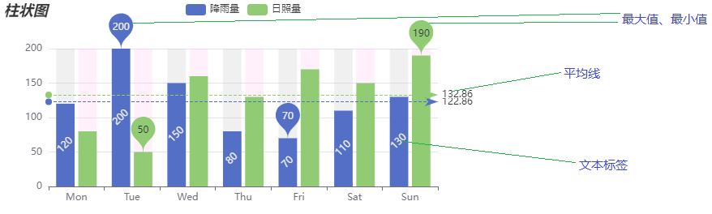

官方文档地址: https://echarts.apache.org/zh/option.html#series-bar

## 柱状图       
### 特点
```
  描述数据分类, 呈现每一个分类中有多少,通过柱状图,可以很清晰的看出每个分类的数据排名情况
```
### 基本设置
```
xAxis: {
  type: 'category',
  data: []
},
yAxis: {
  type: 'value'
}
series: [
  {
    name: '名字',
    type: 'bar',
    data: []
  }
]
```
### 常见效果

#### 标记(最大值,最小值,平均线)
##### [注]: 在series属性上设置
```
· 最大值,最小值
  markPoint: {
    data: [
      {
        type: 'max', name: '最大值'
      },
      {
        type: 'min', name: '最小值'
      }
    ]
  }
· 平均线
  markLine: {
    data: [
      {
        type: 'average', name: '平均值'
      }
    ]
}
```
#### 图形上的文本标签
##### [注]: 在series属性上设置
```
// 图形上的文本标签
label: {
  show: true,
  rotate: 45
},
```
#### 柱的宽度
##### [注]: 在series属性上设置
```
// 柱的宽度
barWidth: 25
```
### 完整配置项
```
export const barChartOptions = () => {
  return {
		xAxis: {
				type: 'category',
				data: ['Mon', 'Tue', 'Wed', 'Thu', 'Fri', 'Sat', 'Sun']
		},
		yAxis: {
				type: 'value',
		},
		series: [{
				name: '降雨量',
				data: [120, 200, 150, 80, 70, 110, 130],
				type: 'bar',
				showBackground: true,  // 是否显示背景色
				backgroundStyle: {
						color: 'rgba(180, 180, 180, 0.2)'
				},
				// 标记最大值最小值 
				markPoint: {
					data: [
						{
							type: 'max', name: '最大值'
						},
						{
							type: 'min', name: '最小值'
						}
					]
				},
				// 平均线
				markLine: {
					data: [
						{
							type: 'average', name: '平均值'
						}
					]
				},
				// 图形上的文本标签
				label: {
					show: true,
					rotate: 45
				},
				// 柱的宽度
				barWidth: 25
		},
		{
			name: '日照量',
			data: [80, 50, 160, 130, 170, 150, 190],
			type: 'bar',
			showBackground: true,  // 是否显示背景色
			backgroundStyle: {
					color: 'rgba(255, 180, 236, 0.2)'
			},
			// 标记最大值最小值 
			markPoint: {
				data: [
					{
						type: 'max', name: '最大值'
					},
					{
						type: 'min', name: '最小值'
					}
				]
			},
			// 平均线
			markLine: {
				data: [
					{
						type: 'average', name: '平均值'
					}
				]
			},
			// 图形上的文本标签
			label: {
				show: true,
				rotate: 45
			},
			// 柱的宽度
			barWidth: 25
	}
	]
	};
}

```