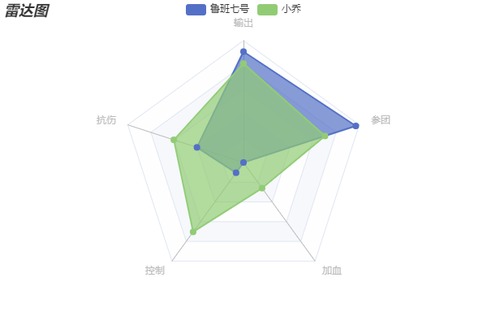

参考文档： https://echarts.apache.org/zh/option.html#series-radar

## 雷达图
### 特点
```
雷达图可以用来分析多个维度的数据与标准数据之间的对比情况
```
### 基本配置
#### 1. radar 
```
雷达图专有的一个配置，配置雷达图的坐标系

radar: {
  shape: 'polygon',  // 设置外圈的样式，circle 圆形 polygon 多边形
  indicator: [  // 雷达图的指示器，用来指定雷达图中的多个变量（维度）
    {name: '输出', max: 500},
    {name: '抗伤', max: 500},
    {name: '控制', max: 500},
    {name: '加血', max: 500},
    {name: '参团', max: 500},
  ]
},
```
#### 2. series
```
配置雷达图的数据

series: [
  {
    name: '战绩',
    type: 'radar',
    data: [
      {
        name: '鲁班七号',
        value: [455, 201, 52, 0, 485]
      },
      {
        name: '小乔',
        value: [406, 301, 352, 130, 352]
      }
    ],
    areaStyle: {  // 设置阴影面积
      show: true
    }
  }
]
```

### 完整配置项

```
import { commonOption } from "./common";

export const radarOption = {
  title: commonOption.title('雷达图'),
  toolbox: commonOption.toolbox,
  legend: commonOption.legend,
  radar: {
    shape: 'polygon',  // 设置外圈的样式，circle 圆形 polygon 多边形
    indicator: [  // 雷达图的指示器，用来指定雷达图中的多个变量（维度）
      {name: '输出', max: 500},
      {name: '抗伤', max: 500},
      {name: '控制', max: 500},
      {name: '加血', max: 500},
      {name: '参团', max: 500},
    ]
  },
  series: [
    {
      name: '战绩',
      type: 'radar',
      data: [
        {
          name: '鲁班七号',
          value: [455, 201, 52, 0, 485]
        },
        {
          name: '小乔',
          value: [406, 301, 352, 130, 352]
        }
      ],
      areaStyle: {  // 设置阴影面积
        show: true
      }
    }
  ]
}
```