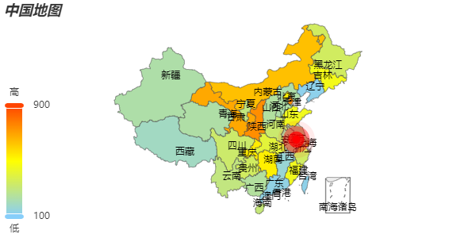

参考文档：https://echarts.apache.org/zh/option.html#series-map
# 地图
## 特点

## 基本配置
### 1. 引入地图的json数据
```
import china from '@/assets/json/map-data/china.json'

注：这里的数据可以用ajax去请求
```
### 2. 将地图数据注册到echarts
```
echarts.registerMap('china', china);  // 注册的时候 别名要与引入的数据名保持一致，不然会有异常

注：这里在注册的时候，官网给的例子是用ajax请求，并在注册的时候值是一个对象，如下： 
  echarts.registerMap('china', {geoJSON: geoJson});
  但是我用ajax请求和直接import数据的方式都试了下，地址只显示南海诸岛，不会显示其他的。
```
### 3. 配置option
```
series: [
  {
    type: 'map',
    map: 'china',   // 这里的名字要与注册的时候的别名一致
    // 文本标签显示
    label: {
      show: true
    },
    // 拖动与缩放
    roam: true,
    // 初始缩放比例
    // zoom: 1.5
    // 地图中心
    center: [118.767413, 32.041544]  // 以江苏省为中心 (值为经纬度，将map.vue中的china输出到控制台就可以看到)
  }
]
```
### 4.完整基础代码
```
<script setup lang='ts'>
import { inject, onMounted, ref } from 'vue';
import china from '@/assets/json/map-data/china.json'

const echarts: any= inject('echarts')
echarts.registerMap('china', china);
console.log(china);

const chart = ref(null)

onMounted(async ()=>{
  const map = echarts.init(chart.value)
  map.setOption({
    series: [
    {
      type: 'map',
      map: 'china',
      // 文本标签显示
      label: {
        show: true
      },
      // 拖动与缩放
      roam: true,
      // 初始缩放比例
      // zoom: 1.5
      // 地图中心
      center: [118.767413, 32.041544]  // 以江苏省为中心 (值为经纬度，将map.vue中的china输出到控制台就可以看到)
    }
  ]
  })
  window.onresize = map.resize()
})

</script>

<template>
<div class="box" ref="chart"></div>
</template>

<style scoped>
.box{
  width: 1000px;
  height: 500px;
  border: 1px solid rebeccapurple;
}
</style>
```
## 常见效果

### 1.地图与散点图配合使用
#### 1.1 通过geo配置地图数据
```
geo: [
  {
    type: 'map',
    map: 'china',
    // 文本标签显示
    label: {
      show: true
    },
    // 拖动与缩放
    roam: true,
    // 初始缩放比例
    // zoom: 1.5
    // 地图中心
    // center: [118.767413, 32.041544]  // 以江苏省为中心 (值为经纬度，将map.vue中的china输出到控制台就可以看到)
  },
],
```
#### 1.2 通过series配置散点图数据
```
series: [  // 地图与散点图结合使用
  {
    type: 'effectScatter',
    coordinateSystem: 'geo',  // 让散点图使用地图的坐标
    data: [[118.767413, 32.041544]],  // 数据为地图上的经纬度
    rippleEffect: {  // 让涟漪效果更加明显一点
      scale: 5
    }
  }
]
```
### 2 不同区域显示不同颜色
#### 2.1 用geo配置基本地图
```
geo: [{
  type: 'map',
  map: 'china',
  // 文本标签显示
  label: {
    show: true
  },
  // 拖动与缩放
  roam: true,
  // 初始缩放比例
  // zoom: 1.5
  // 地图中心
  // center: [118.767413, 32.041544]  // 以江苏省为中心 (值为经纬度，将map.vue中的china输出到控制台就可以看到)
},],
```
#### 2.2 用series配置地图数据，并将他们关联
```
series: [
  {
    type: 'map',
    geoIndex: 0,   // 将数据与第一个geo对象关联
    data:[
      { name: "上海", value: 432 },
      { name: "北京", value: 543 },
      { name: "天津", value: 753 },
      { name: "重庆", value: 543 },
      { name: "河北", value: 232 },
      { name: "河南", value: 324 },
      { name: "云南", value: 295 },
      { name: "辽宁", value: 123 },
      { name: "黑龙江", value: 346 },
      { name: "湖南", value: 532 },
      { name: "安徽", value: 234 },
      { name: "山东", value: 452 },
      { name: "新疆", value: 231 },
      { name: "江苏", value: 231 },
      { name: "浙江", value: 342 },
      { name: "江西", value: 159 },
      { name: "湖北", value: 407 },
      { name: "广西", value: 247 },
      { name: "甘肃", value: 687 },
      { name: "山西", value: 244 },
      { name: "内蒙古", value: 635 },
      { name: "陕西", value: 742 },
      { name: "吉林", value: 462 },
      { name: "福建", value: 452},
      { name: "贵州", value: 346},
      { name: "广东", value: 136 },
      { name: "青海", value: 234},
      { name: "西藏", value: 189 },
      { name: "四川", value: 329 },
      { name: "宁夏", value: 298 },
      { name: "海南", value: 308 },
      { name: "台湾", value: 127 },
      { name: "香港", value: 584 },
      { name: "澳门", value: 356 }
    ]
  },
]
```
#### 2.3 配置visualMap
**
  如果有多个series中的对象，指定visualMap给哪一个series很重要，不然itemStyle.color将会被覆盖。
 seriesIndex: 索引值
**
```
visualMap: {
  min: 100,   // 数据的范围值
  max: 900,   // 数据的范围值
  text: ['高', '低'],   
  calculable: true,   // 是由显示可筛选的滑块
  seriesIndex: 1,  // 将visualMap配置给哪一个series，默认是全部，如果不指定，在series中设置的itemStyle.color将会被覆盖
  inRange: {
    color: ['lightskyblue', 'yellow', 'orangered']
  }
}
```
## 完整代码
```
1. map.vue

  <script setup lang='ts'>
  import { inject, onMounted, ref } from 'vue';
  import china from '@/assets/json/map-data/china.json';
  import { mapOption } from '../../assets/ts/charts/map';

  const echarts: any= inject('echarts')
  echarts.registerMap('china', china);  // 注册的时候 别名要与引入的数据名保持一致，不然会有异常
  console.log(11111, china);

  const chart = ref(null)

  onMounted(async ()=>{
    const map = echarts.init(chart.value)
    map.setOption(mapOption)
    window.onresize = map.resize()
  })

  </script>

  <template>
  <div class="box" ref="chart"></div>
  </template>

  <style scoped>
  .box{
    width: 600px;
    height: 300px;
    border: 1px solid rebeccapurple;
  }
  </style>

2. map.ts

  import { commonOption } from "./common"

  export const mapOption = {
    title: commonOption.title('中国地图'),
    toolbox: commonOption.toolbox,
    geo: [{
      type: 'map',
      map: 'china',
      // 文本标签显示
      label: {
        show: true
      },
      // 拖动与缩放
      roam: true,
      // 初始缩放比例
      // zoom: 1.5
      // 地图中心
      // center: [118.767413, 32.041544]  // 以江苏省为中心 (值为经纬度，将map.vue中的china输出到控制台就可以看到)
    },],
    series: [  // 地图与散点图结合使用
      {
        type: 'effectScatter',
        coordinateSystem: 'geo',  // 让散点图使用地图的坐标
        data: [[118.767413, 32.041544]],  // 数据为地图上的经纬度
        visualMap: false,
        rippleEffect: {  // 让涟漪效果更加明显一点
          scale: 5
        },
        itemStyle: {
          color: 'red'
        },
      },
      
      // 不同区域显示不同颜色
      {
        type: 'map',
        geoIndex: 0,   // 将数据与第一个geo对象关联
        data:[
          { name: "上海", value: 432 },
          { name: "北京", value: 543 },
          { name: "天津", value: 753 },
          { name: "重庆", value: 543 },
          { name: "河北", value: 232 },
          { name: "河南", value: 324 },
          { name: "云南", value: 295 },
          { name: "辽宁", value: 123 },
          { name: "黑龙江", value: 346 },
          { name: "湖南", value: 532 },
          { name: "安徽", value: 234 },
          { name: "山东", value: 452 },
          { name: "新疆", value: 231 },
          { name: "江苏", value: 231 },
          { name: "浙江", value: 342 },
          { name: "江西", value: 159 },
          { name: "湖北", value: 407 },
          { name: "广西", value: 247 },
          { name: "甘肃", value: 687 },
          { name: "山西", value: 244 },
          { name: "内蒙古", value: 635 },
          { name: "陕西", value: 742 },
          { name: "吉林", value: 462 },
          { name: "福建", value: 452},
          { name: "贵州", value: 346},
          { name: "广东", value: 136 },
          { name: "青海", value: 234},
          { name: "西藏", value: 189 },
          { name: "四川", value: 329 },
          { name: "宁夏", value: 298 },
          { name: "海南", value: 308 },
          { name: "台湾", value: 127 },
          { name: "香港", value: 584 },
          { name: "澳门", value: 356 }
        ]
      },
    ],
    visualMap: {
      min: 100,
      max: 900,
      text: ['高', '低'],
      calculable: true,
      seriesIndex: 1,
      inRange: {
        color: ['lightskyblue', 'yellow', 'orangered']
      }
    }
  }
```