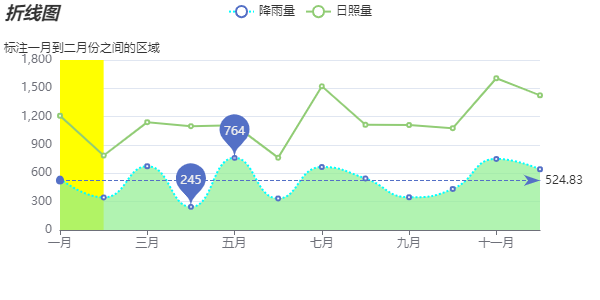

官方文档地址： https://echarts.apache.org/zh/option.html#series-line
## 折线图
### 特点
```
折线图通常用来分析数据随时间的变化趋势
```
### 基本设置
```
在series中将type设置为line
```
### 常见效果

#### 1.标记 （最大值，最小值，平均线, 标注区间）
###### [注]: 在series属性上设置
```
· 最大值,最小值
  markPoint: {
    data: [
      {
        type: 'max', name: '最大值'
      },
      {
        type: 'min', name: '最小值'
      }
    ]
  }
· 平均线
  markLine: {
    data: [
      {
        type: 'average', name: '平均值'
      }
    ]
}
· 区间标注
  markArea: {
    data: [
      [
        {
            name: '标注一月到二月份之间的区域',
            itemStyle: {
              color: 'yellow'
            },
            xAxis: '一月',
        },
        {
            xAxis: '二月',
        },
    ]
    ]
  }
```
#### 2.线条显示
###### [注]: 在series属性上设置
##### 2.1平滑曲线
```
smooth: true
```
##### 2.2线条样式
```
lineStyle: {
  color: 'cyan',
  type: 'dotted'
},
```
#### 3.填充样式
###### [注]: 在series属性上设置
```
areaStyle: {
  color: 'lightgreen'
},
```
#### 4.紧挨边缘(曲线与y轴相交)
###### [注]: 在xAxis属性上设置
```
boundaryGap: false
```
#### 5.脱离0值比例(y轴坐标值不从0值开始)
###### [注]: 在yAxis属性上设置
```
scale: true,
```
#### 6.堆叠图
###### [注]: 在series属性上设置
```
stack: 'wahaha',  // 值可以随便设置，但是要在堆叠的数据项中保持一致。
```

### 完整配置项
```
import { commonOption } from './common'

export const lineOptions = {
  title: commonOption.title('折线图'),
  legend: commonOption.legend,
  tooltip: commonOption.tooltip,
  toolbox: commonOption.toolbox,
  xAxis: {
    type: 'category',
    data: ['一月', '二月', '三月', '四月', '五月', '六月', '七月', '八月', '九月', '十月', '十一月', '十二月'],
    // 紧挨边缘(与Y轴相交)
    boundaryGap: false
  },
  yAxis: {
    type: 'value',
    // 脱离0值比例(y轴坐标值不从0开始)
    scale: true,
  },
  series: [
    {
      name: '降雨量',
      type: 'line',
      data: [544, 345, 675, 245, 764, 334, 667, 546, 347, 435, 753, 643],
      // 最大值、最小值
      markPoint: {
        data: [
          {
            type: 'max', name: '最大值'
          },
          {
            type: 'min', name: '最小值'
          }
        ]
      },
      // 平均线
      markLine: {
        data: [
          {
            type: 'average', name: '平均线'
          }
        ]
      },
      // 平滑曲线
      smooth: true,
      // 线条样式
      lineStyle: {
        color: 'cyan',
        type: 'dotted'
      },
      // 区域填充
      areaStyle: {
        color: 'lightgreen'
      },
      // 堆叠图
      stack: 'wahaha'
    },
    {
      name: '日照量',
      type: 'line',
      data: [666, 443, 467, 854, 346, 432, 854, 568, 765, 643, 854, 783],
      stack: 'wahaha',
      markArea: {
        data: [
          [
            {
                name: '标注一月到二月份之间的区域',
                itemStyle: {
                  color: 'yellow'
                },
                xAxis: '一月',
            },
            {
                xAxis: '二月',
            },
        ]
        ]
      }
    },
  ]
}
```