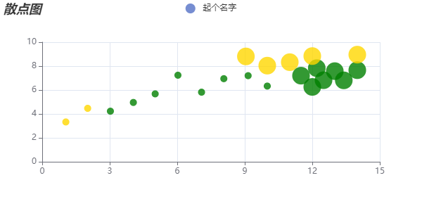

官方参考文档： https://echarts.apache.org/zh/option.html#series-scatter

## 散点图
### 特点
```
· 帮助我们不同数据维度之间的相关性
· 散点图也经常用在地图的标注上
```
### 基本设置
```
xAxis: {},
yAxis: {},
series: [
  {
    name: '起个名字',
    type: 'scatter',
    data: [[],[]]
  }
]
```
### 常见效果

#### 1.气泡图
##### symbalSize -设置点的大小
```
// 支持回调函数
// symbalSize: 30;

symbolSize: (args: any) => {
  // console.log(args);
  if (args[0] > 10 || args[1] > 8) return 25;
  return 10;
},
```
##### itemStyle -设置点的样式
```
// 支持回调函数
// itemStyle: {color: 'red'}

itemStyle: {
  color: (args: any) => {
    // console.log(args)
    if (args.data[0] < 3 || args.data[1] > 8) return 'gold'
    return 'green'
  },
},
```
#### 2.涟漪效果
```
type: 'effectScatter',  // 设置涟漪效果
showEffectOn: 'emphasis',  // 涟漪效果产生时间 render: 渲染完成， emphasis： 鼠标悬停
reppleEffect: {  // 涟漪效果缩放比例
  size: 5
},
```
### 完整配置项
```
import { commonOption } from "./common";

export const scatterOption = {
  title: commonOption.title('散点图'),
  legend: commonOption.legend,
  tooltip: commonOption.tooltip,
  toolbox: commonOption.toolbox,
  xAxis: {},
  yAxis: {},
  series: [
    {
      name: '起个名字',
      // type: 'scatter',
      type: 'effectScatter',  // 设置涟漪效果
      showEffectOn: 'emphasis',  // 涟漪效果产生时间 render: 渲染完成， emphasis： 鼠标悬停
      reppleEffect: {  // 涟漪效果缩放比例
        size: 5
      },
      // 气泡大小设置
      symbolSize: (args: any) => {
        // console.log(args);
        if (args[0] > 10 || args[1] > 8) return 25;
        return 10;
      },
      // 气泡颜色设置
      itemStyle: {
        color: (args: any) => {
          // console.log(args)
          if (args.data[0] < 3 || args.data[1] > 8) return 'gold'
          return 'green'
        },
      },
      data: [
        [10.0, 8.04],
        [8.07, 6.95],
        [13.0, 7.58],
        [9.05, 8.81],
        [11.0, 8.33],
        [14.0, 7.66],
        [13.4, 6.81],
        [10.0, 6.33],
        [14.0, 8.96],
        [12.5, 6.82],
        [9.15, 7.2],
        [11.5, 7.2],
        [3.03, 4.23],
        [12.2, 7.83],
        [2.02, 4.47],
        [1.05, 3.33],
        [4.05, 4.96],
        [6.03, 7.24],
        [12.0, 6.26],
        [12.0, 8.84],
        [7.08, 5.82],
        [5.02, 5.68]
      ],
    }
  ]
}
```