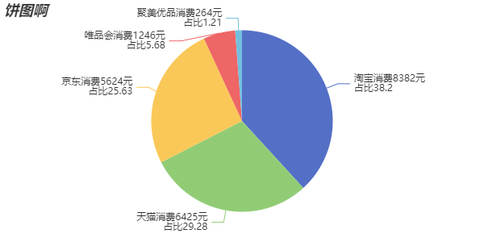

官网参考文档：https://echarts.apache.org/zh/option.html#series-pie
## 饼图
### 特点
```
饼图可以很好的帮助用户快速了解不同分类数据的占比情况
```
### 基本设置
```
series: [
  {
    type: 'pie',
    data: [
      {name: '淘宝', value: 8382},
      {name: '天猫', value: 6425},
      {name: '京东', value: 5624},
      {name: '唯品会', value: 1246},
      {name: '聚美优品', value: 264},
    ],
  }
]
```
### 常用设置项

#### 1. label -文本标签
```
设置显示的提示文字
label: {
  show: true,
  formatter: (args: any)=>{
    // console.log(args);
    return `${args.name}消费${args.value}元\n占比${args.percent}`
  }
},
```
#### 2. radius -圆环设置
```
· radius: 50,  // 直接设置饼图的半径
· radius: '50%',  // 半径设置为百分比，是包含饼图容器的长宽中较小一个的一般的百分比
· radius: ['50%', '80%'], // 设置为圆环，第一个值为内圆半径，第二个为外圆半径
```
#### 3. selectedMode -选中模式的配置
```
selectedMode: 
  · 'single': 单选，点一某个扇区偏移之后再点击其他的扇区之前的会还原回去
  · 'multiple': 多选，点击某个扇区之后再点击其他的扇区之前的不会还原回去

selectedOffset: 20  // 点击扇区之后的偏移量

```
#### 4. roseType -南丁格尔图
```
不同扇区半径不一样
roseType:
  · 'radius'： 扇区圆心角展现数据的百分比，半径展现数据的大小。
  · 'area'：  所有扇区圆心角相同，仅通过半径展现数据大小。
```

### 完整配置项
```
import { commonOption } from "./common";

export const pieOption = {
  title: commonOption.title('饼图啊'),
  legned: commonOption.legend,
  tooltip: commonOption.tooltip,
  toolbox: commonOption.toolbox,
  series: [
    {
      type: 'pie',
      data: [
        {name: '淘宝', value: 8382},
        {name: '天猫', value: 6425},
        {name: '京东', value: 5624},
        {name: '唯品会', value: 1246},
        {name: '聚美优品', value: 264},
      ],
      // 文字标签
      label: {
        show: true,
        formatter: (args: any)=>{
          // console.log(args);
          return `${args.name}消费${args.value}元\n占比${args.percent}`
        }
      },
      // 设置为圆环
      // radius: ['50%', '80%'],
      // 南丁格尔图
      // roseType: 'radius',
      // 选择效果设置
      selectedMode: 'single',  //single, multiple
      // 选中过之后的偏移量设置
      // selectedOffset: 50
    }
  ]
}
```
